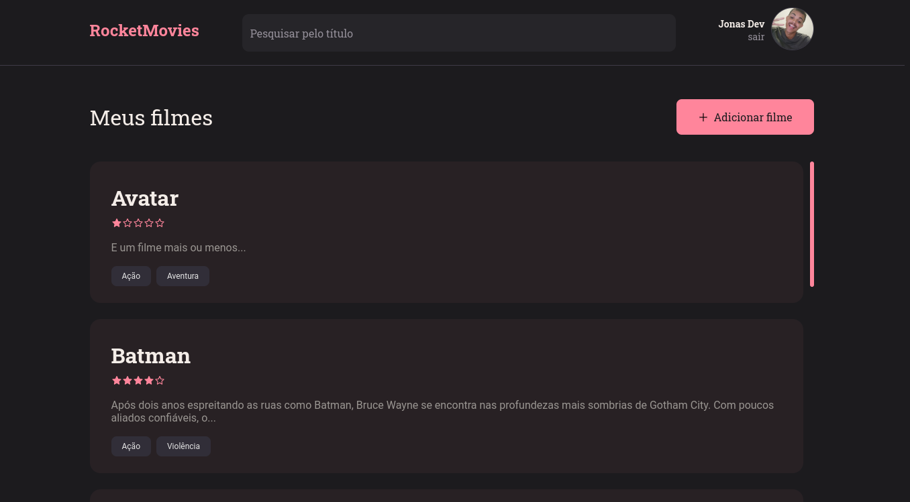

# React Movies

The challenge is to app create notes to movies

[](https://www.linkedin.com/in/jonas-martins-950a30184/)

 <p align="center">
  <a href="#-technologies">Technologies</a>&nbsp;&nbsp;&nbsp;|&nbsp;&nbsp;&nbsp;
  <a href="#-project">Project</a>&nbsp;&nbsp;&nbsp;|&nbsp;&nbsp;&nbsp;
  <a href="#-project">Init Project</a>
</p>

## 🚀 Technologies


This project was developed  with the following technologies:

- React
- Styled components
- Express
- Knex

## Project




Apprenticeship

- Authenticated
- Upload Image
- Integration Front and Back


## 🚀 Init Project

#### BACKEND
 
clone the project, go to the folder, then start migrations and start app

```bash
$ https://github.com/jonasmartinsdev/note_app.git
$ cd api
$ yarn
$ yarn migrate
$ yarn dev 
```

#### FRONTEND
```bash
$ cd fe
$ yarn
$ yarn dev
```

<p align="center">created with 💜 Jonas Martins👋</p>
